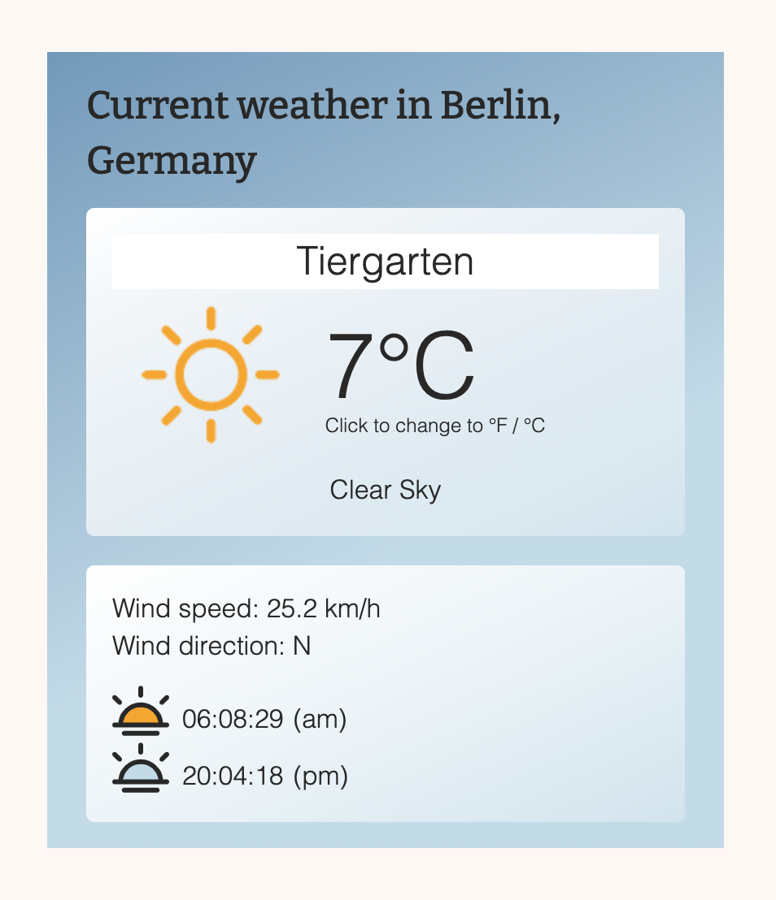
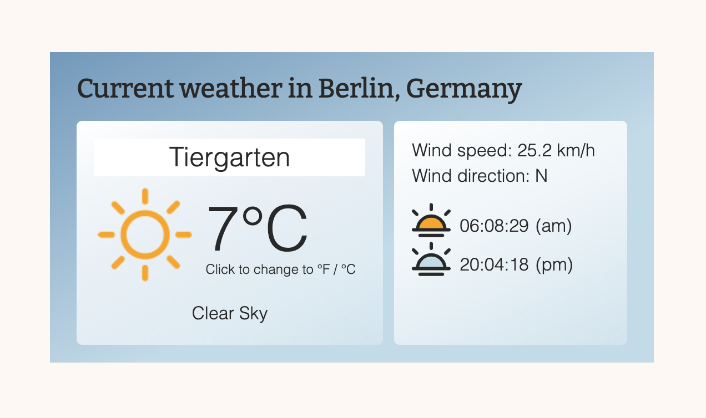

# Weather App

## What is this about?
A weather app, fetching data from [OpenWeatherMap](https://openweathermap.org/api)
- sign up to OpenWeatherMap to get an API key
- sign up is free, at point of writing [60 calls per minute is free, see pricing](https://openweathermap.org/price)
- [OpenWeatherMap FAQs](https://openweathermap.org/faq)
- [OpenWeatherMap current data](https://openweathermap.org/current)

### Visuals - what you get with this code
480px

640px

### My requirements
- language english
- show weather of **fixed** location (Tiergarten, Berlin, Germany) which is pretty close to my exact location)
- based on that location, fetch/show
    - weather icon(s)
    - temperature, with possibility to toggle between °F and °C
    - weather description
    - wind speed (in km/h)
    - wind direction (compass)
    - sunrise (am, BUT shown in 24-hrs)
    - sunset (pm, BUT shown in 24-hrs)

### Tech
- HTML, SCSS, JavaScript, [parcel.js](https://parceljs.org/)
- responsive (340px min width), one content shift at 640px width
- Flexbox and CSS Grid
- search and prepare [sunrise/sunset svgs](https://fontawesome.com/icons) regarding colors
- search and prepare weather icons to use other ones than [the ones offered on OpenWeatherMap](https://openweathermap.org/weather-conditions#Weather-Condition-Codes-2)

### How to run this?

- clone the repo
- cd into project
- run `npm install`
- run `parcel index.html --open`, this will fire up the server at http://localhost:1234
<!-- - to run in development mode: `npm run dev`, this will fire up the server at http://localhost:1234
- to run in production mode: `npm run build`, this will also minify your files into the `dist` folder -->
- stop the server with `control c`

### Research starting point sources
**main**
- [video - Code Explained: Build A Weather App Using JavaScript](https://www.youtube.com/watch?v=KqZGuzrY9D4)
- [source code to download](https://www.codeexplained.org/2020/06/Build-A-Weather-App-Using-JavaScript.html)
- [original source for Weather Icons to download](https://github.com/manifestinteractive/weather-underground-icons) (for dynamic exchange, depending on weather) 

**second**
- [video - Tyler Potts: Build a Weather app using HTML, CSS & JavaScript in 2020](https://www.youtube.com/watch?v=n4dtwWgRueI)
- [source code on GitHub](https://github.com/TylerPottsDev/weather-app-js)
